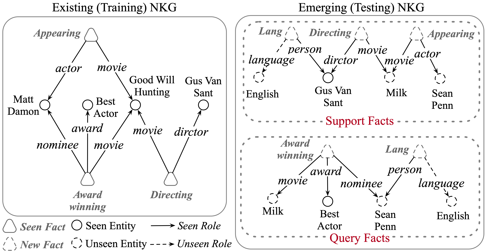
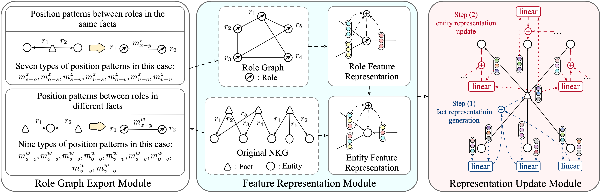

<div style="max-width: 1000px; margin: 0 auto;">
  
# MetaNIR

In real-world NKGs, new facts involving unseen entities and roles frequently emerge, requiring completing these facts. 

<p align="center">
 <br><em>Fig 1. An example of NKGs in the inductive setting. Unseen entities and roles emerge during testing.</em>
</p> 

Thus, this work proposes a new task, Inductive Link Prediction in NKGs (ILPN), which aims to predict missing elements in facts involving unseen entities and roles in emerging NKGs. To address this task, we propose a Meta-learning-based Nary knowledge Inductive Reasoner (MetaNIR), which employs a graph neural network with meta-learning mechanisms to embed unseen entities and roles adaptively.

## Method illustration

MetaNIR is a GNN-based framework that utilizes neighbor information in support facts to generate representations for unseen elements. It comprises three modules: the role graph export module, the feature representation module, and the representation update module. The role graph export module exports a role graph, which expresses the patterns between roles. Then, the feature representation module leverages these patterns to generate feature representations for unseen roles and entities. Next, the representation update module employs a role-aware hierarchical GNN to update representations for both unseen and seen elements. These updated representations are subsequently used to predict missing elements in query facts.

<p align="center">
 <br><em>Fig 2. The overview of the proposed MetaNIR model.</em>
</p> 

## Steps to run the experiments

### Requirements
* ``Python 3.9.4 ``
* ``PyTorch 1.9.1``
* ``Numpy 1.19.2``
* ``Torch-scatter 2.0.8``

### The detail hyper-parameters
|   Parameter   |  JF-Ext  |  Wiki-Ext  |  WD-Ext  |
|  ----  | ----  | ----  | ----  |
|  Embedding dim  | 512 | 512 | 512 |
|  Batch size  | 128 | 128 | 128 |
|  Learning rate  | 1e-4 | 1e-4 | 1e-4 |
|  GNN layer  | 2 | 2 | 2 |

### Starting training and evaluation

* On JF-Ext
```
<!-- original -->
nohup python main.py --dataset IJF17K --gpu cuda:0 --subgraph_type v2 --metalearning True --adjustment False --initent True --initrel True --gnnent True --gnnrel False --sub_train_ent_num 50 --train_task_query_rate 0.1 --rw_0 10 --rw_1 10 --rw_2 5 --task_mask_rate 0.1 --ent_neighbor 5 --rel_neighbor 5 --adjustment_type all --adjustment_reduce True --ent_beta 5 --rel_beta 5 --pred_truth False --use_seed False --lr 1e-4 --save_emb True --u_redu True --dim 512 > results/IJF17K_TTTTT_512.out &
<!-- meta -->
nohup python main.py --dataset IJF17K --gpu cuda:0 --subgraph_type v2 --metalearning False --adjustment False --initent True --initrel True --gnnent True --gnnrel False --sub_train_ent_num 50 --train_task_query_rate 0.1 --rw_0 10 --rw_1 10 --rw_2 5 --task_mask_rate 0.1 --ent_neighbor 5 --rel_neighbor 5 --adjustment_type all --adjustment_reduce True --ent_beta 5 --rel_beta 5 --pred_truth False --use_seed False --lr 1e-4 --save_emb True --u_redu True --dim 512 > results/IJF17K_FTTTT_512.out &
<!-- initrel -->
nohup python main.py --dataset IJF17K --gpu cuda:1 --subgraph_type v2 --metalearning True --adjustment False --initent True --initrel False --gnnent True --gnnrel False --sub_train_ent_num 50 --train_task_query_rate 0.1 --rw_0 10 --rw_1 10 --rw_2 5 --task_mask_rate 0.1 --ent_neighbor 5 --rel_neighbor 5 --adjustment_type all --adjustment_reduce True --ent_beta 5 --rel_beta 5 --pred_truth False --use_seed False --lr 1e-4 --save_emb True --u_redu True --dim 512 > results/IJF17K_TFTTT_512.out &
<!-- initent -->
nohup python main.py --dataset IJF17K --gpu cuda:2 --subgraph_type v2 --metalearning True --adjustment False --initent False --initrel True --gnnent True --gnnrel False --sub_train_ent_num 50 --train_task_query_rate 0.1 --rw_0 10 --rw_1 10 --rw_2 5 --task_mask_rate 0.1 --ent_neighbor 5 --rel_neighbor 5 --adjustment_type all --adjustment_reduce True --ent_beta 5 --rel_beta 5 --pred_truth False --use_seed False --lr 1e-4 --save_emb True --u_redu True --dim 512 > results/IJF17K_TTFTT_512.out &
<!-- gnn -->
nohup python main.py --dataset IJF17K --gpu cuda:3 --subgraph_type v2 --metalearning True --adjustment False --initent True --initrel True --gnnent False --gnnrel False --sub_train_ent_num 50 --train_task_query_rate 0.1 --rw_0 10 --rw_1 10 --rw_2 5 --task_mask_rate 0.1 --ent_neighbor 5 --rel_neighbor 5 --adjustment_type all --adjustment_reduce True --ent_beta 5 --rel_beta 5 --pred_truth False --use_seed False --lr 1e-4 --save_emb True --u_redu True --dim 512 > results/IJF17K_TTTFT_512.out &
```
* On Wiki-Ext
```
<!-- original -->
nohup python main.py --dataset IWikiPeople --gpu cuda:1 --subgraph_type v2 --metalearning True --adjustment False --initent True --initrel True --gnnent True --gnnrel False --sub_train_ent_num 50 --train_task_query_rate 0.1 --rw_0 10 --rw_1 10 --rw_2 5 --task_mask_rate 0.1 --ent_neighbor 5 --rel_neighbor 5 --adjustment_type all --adjustment_reduce True --ent_beta 5 --rel_beta 5 --pred_truth False --use_seed False --lr 1e-4 --u_redu True --dim 512 > results/IWikiPeople_TTTTT_512.out &
<!-- meta -->
nohup python main.py --dataset IWikiPeople --gpu cuda:3 --subgraph_type v2 --metalearning False --adjustment False --initent True --initrel True --gnnent True --gnnrel False --sub_train_ent_num 50 --train_task_query_rate 0.1 --rw_0 10 --rw_1 10 --rw_2 5 --task_mask_rate 0.1 --ent_neighbor 5 --rel_neighbor 5 --adjustment_type all --adjustment_reduce True --ent_beta 5 --rel_beta 5 --pred_truth False --use_seed False --lr 1e-4 --u_redu True --dim 512 > results/IWikiPeople_FTTTT_512.out &
<!-- initrel -->
nohup python main.py --dataset IWikiPeople --gpu cuda:0 --subgraph_type v2 --metalearning True --adjustment False --initent True --initrel False --gnnent True --gnnrel False --sub_train_ent_num 50 --train_task_query_rate 0.1 --rw_0 10 --rw_1 10 --rw_2 5 --task_mask_rate 0.1 --ent_neighbor 5 --rel_neighbor 5 --adjustment_type all --adjustment_reduce True --ent_beta 5 --rel_beta 5 --pred_truth False --use_seed False --lr 1e-4 --u_redu True --dim 512 > results/IWikiPeople_TFTTT_512.out &
<!-- initent -->
nohup python main.py --dataset IWikiPeople --gpu cuda:1 --subgraph_type v2 --metalearning True --adjustment False --initent False --initrel True --gnnent True --gnnrel False --sub_train_ent_num 50 --train_task_query_rate 0.1 --rw_0 10 --rw_1 10 --rw_2 5 --task_mask_rate 0.1 --ent_neighbor 5 --rel_neighbor 5 --adjustment_type all --adjustment_reduce True --ent_beta 5 --rel_beta 5 --pred_truth False --use_seed False --lr 1e-4 --u_redu True --dim 512 > results/IWikiPeople_TTFTT_512.out &
<!-- gnn -->
nohup python main.py --dataset IWikiPeople --gpu cuda:2 --subgraph_type v2 --metalearning True --adjustment False --initent True --initrel True --gnnent False --gnnrel False --sub_train_ent_num 50 --train_task_query_rate 0.1 --rw_0 10 --rw_1 10 --rw_2 5 --task_mask_rate 0.1 --ent_neighbor 5 --rel_neighbor 5 --adjustment_type all --adjustment_reduce True --ent_beta 5 --rel_beta 5 --pred_truth False --use_seed False --lr 1e-4 --u_redu True --dim 512 > results/IWikiPeople_TTTFT_512.out &
```
* On WD-Ext
```
<!-- original -->
nohup python main.py --dataset IWD50K --gpu cuda:2 --subgraph_type v2 --metalearning True --adjustment False --initent True --initrel True --gnnent True --gnnrel False --sub_train_ent_num 50 --train_task_query_rate 0.1 --rw_0 10 --rw_1 10 --rw_2 5 --task_mask_rate 0.1 --ent_neighbor 5 --rel_neighbor 5 --adjustment_type all --adjustment_reduce True --ent_beta 5 --rel_beta 5 --pred_truth False --use_seed False --lr 1e-4 --save_emb True --u_redu True --dim 512 > results/IWD50K_TTTTT_512.out &
<!-- meta -->
nohup python main.py --dataset IWD50K --gpu cuda:0 --subgraph_type v2 --metalearning False --adjustment False --initent True --initrel True --gnnent True --gnnrel False --sub_train_ent_num 50 --train_task_query_rate 0.1 --rw_0 10 --rw_1 10 --rw_2 5 --task_mask_rate 0.1 --ent_neighbor 5 --rel_neighbor 5 --adjustment_type all --adjustment_reduce True --ent_beta 5 --rel_beta 5 --pred_truth False --use_seed False --lr 1e-4 --save_emb True --u_redu True --dim 512 > results/IWD50K_FTTTT_512.out &
<!-- initrel -->
nohup python main.py --dataset IWD50K --gpu cuda:3 --subgraph_type v2 --metalearning True --adjustment False --initent True --initrel False --gnnent True --gnnrel False --sub_train_ent_num 50 --train_task_query_rate 0.1 --rw_0 10 --rw_1 10 --rw_2 5 --task_mask_rate 0.1 --ent_neighbor 5 --rel_neighbor 5 --adjustment_type all --adjustment_reduce True --ent_beta 5 --rel_beta 5 --pred_truth False --use_seed False --lr 1e-4 --save_emb True --u_redu True --dim 512 > results/IWD50K_TFTTT_512.out &
<!-- initent -->
nohup python main.py --dataset IWD50K --gpu cuda:2 --subgraph_type v2 --metalearning True --adjustment False --initent False --initrel True --gnnent True --gnnrel False --sub_train_ent_num 50 --train_task_query_rate 0.1 --rw_0 10 --rw_1 10 --rw_2 5 --task_mask_rate 0.1 --ent_neighbor 5 --rel_neighbor 5 --adjustment_type all --adjustment_reduce True --ent_beta 5 --rel_beta 5 --pred_truth False --use_seed False --lr 1e-4 --save_emb True --u_redu True --dim 512 > results/IWD50K_TTFTT_512.out &
<!-- gnn -->
nohup python main.py --dataset IWD50K --gpu cuda:1 --subgraph_type v2 --metalearning True --adjustment False --initent True --initrel True --gnnent False --gnnrel False --sub_train_ent_num 50 --train_task_query_rate 0.1 --rw_0 10 --rw_1 10 --rw_2 5 --task_mask_rate 0.1 --ent_neighbor 5 --rel_neighbor 5 --adjustment_type all --adjustment_reduce True --ent_beta 5 --rel_beta 5 --pred_truth False --use_seed False --lr 1e-4 --save_emb True --u_redu True --dim 512 > results/IWD50K_TTTFT_512.out &
```

### Datasets
* Download datasets [JF-Ext, Wiki-Ext, WD-Ext](https://drive.google.com/drive/folders/1dtHN-FMH1VYWUyEQGv7u7_PAp5AmL7gN?usp=drive_link)

</p> 
